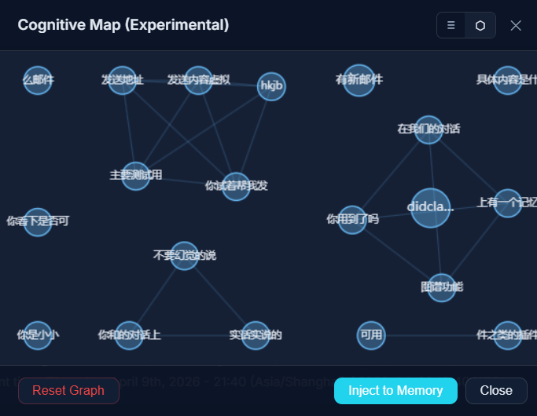
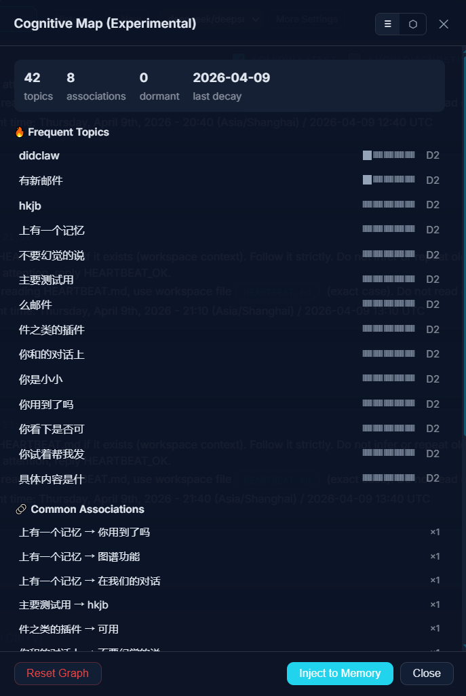

# topic-memory-graph

从对话文本构建**话题图**（含简单衰减、关联与可选的情绪/轨迹信号），并生成可注入 `AGENTS.md` 或同类 Agent 上下文文件的 **Markdown 片段** 的 TypeScript 库。

源自 [DidClaw](https://github.com/) 客户端（LCLAW monorepo），可独立发布与复用。**零运行时依赖。**

**[English README](README.md)**

## 截图

[DidClaw](https://github.com/) 桌面端在相同图数据之上提供 **认知地图（实验性）** 界面：力导向网络视图，以及带高频话题与关联边的列表面板。





## 安装

```bash
pnpm add topic-memory-graph
# 或: npm install topic-memory-graph
```

## 快速用法

```ts
import {
  emptyGraph,
  updateGraph,
  applyDecay,
  generateMemorySection,
  shouldInjectMemory,
  injectMemorySection,
  DEFAULT_MARKERS,
  DEFAULT_INJECT_INTERVAL_RUNS,
} from "topic-memory-graph";

let graph = emptyGraph();
graph = updateGraph(graph, "user message", "assistant reply");

const md = generateMemorySection(graph, { attribution: "MyApp" });
const agentsBody = injectMemorySection(existingAgentsMd, md, DEFAULT_MARKERS);
```

将 `graph` 以 JSON 形式持久化即可（文件系统、Tauri、IndexedDB 等）。与 DidClaw 桌面对齐的说明见 `integrations/tauri-reference.md`。

## 主要 API

| 导出 | 作用 |
|------|------|
| `extractTopics`、`updateGraph`、`applyDecay` | 图的核心维护 |
| `generateMemorySection(graph, { attribution? })` | 生成给 Agent 读的 Markdown |
| `shouldInjectMemory(graph, runsSinceLastInject, minRuns?)` | 判断是否该再次注入 |
| `injectMemorySection(md, content, markers?)` | 用 HTML 注释安全替换或追加区块 |
| `DEFAULT_MARKERS`、`DIDCLAW_PHEROMONE_MARKERS` | 注入时使用的成对标记 |

## 图结构

`PheromoneGraph` 为带版本号的 JSON（`GRAPH_SCHEMA_VERSION`）。宿主若与未来版本合并字段，应**保留未知字段**以便向前兼容。

## 情绪模式 A / B / C / N

由用户文本上的 **正则启发式** 得到，用于调节节点/边的更新策略（例如收窄焦点、扩展联想、低能量反复等），**不是**临床级情感打分。

## 与 OpenClaw Dreaming 的对比（概念层）

两者可以**同时存在**：一方是 Gateway 内的日记/REM/回放与晋升管线；本库是**客户端可插拔、本库内不调 LLM** 的轻量话题图。

| 维度 | OpenClaw Dreaming（如 2026.4.9 起） | topic-memory-graph |
|------|--------------------------------------|---------------------|
| 隐喻 | 偏「日记与归档 + 回放/晋升」的一体化管线 | 偏「对话当下走出来的路径」——强化常被走过的话题与边 |
| 触发 | 批量（夜间 REM / Light、日记 backfill 等） | 流式（每轮对话结束可更新） |
| 学习规则 | 上游多阶段抽取与晋升（含 grounded、durable 等） | **情绪调制**（A/B/C 改变节点与边的更新方式） |
| 遗忘 | 由阈值与管线阶段决定保留与否 | **显式衰减**（按天 ×0.97，可进入 dormant，结构仍保留） |
| 关联 | 共现与上游记忆栈策略 | **传递桥接**（强 A→B 与 B→C 可生成弱 A→C） |
| 可观测性 | Control UI 日记/时间线/Scene 等 | **实时图**（节点、边、轨迹、blocked 点）+ 可选 UI |
| 本库成本 | 日记/梦境等环节通常涉及 LLM 与 Gateway | **本库零 LLM 调用**（纯 TypeScript；上下文里用不用模型由宿主决定） |

说明：OpenClaw 在持续演进，上表是**能力取向**的对比，非完整功能清单。若你同时用官方 Gateway，建议以对应版本的 release notes 为准。

## 许可

[MIT](LICENSE)。（LCLAW 大仓库中其他目录可能使用不同许可证，与本包无关。）

## 开发本包

```bash
cd packages/cognitive-memory-graph
pnpm install
pnpm test
pnpm build
```

单独克隆：`git clone https://github.com/didclawapp-ai/topic-memory-graph.git`。在 LCLAW monorepo 中，当前源码目录名为 `packages/cognitive-memory-graph`（本地若改名为 `topic-memory-graph` 仅影响路径，不影响包名 `topic-memory-graph`）。
